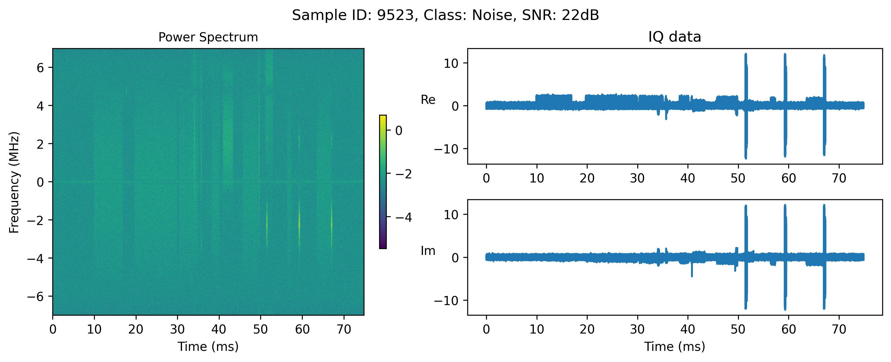
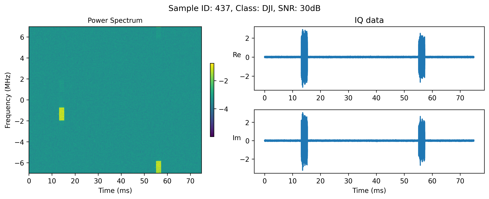
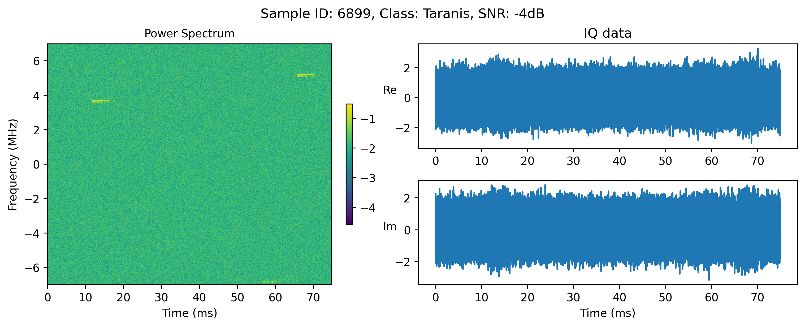

# Robust Drone Detection and Classification Using Convolutional Neural Networks in Low SNR Environments
Code to reproduce the experiments from the paper:

S. Glüge, M. Nyfeler, A. Aghaebrahimian, N. Ramagnano and C. Schüpbach, "Robust Low-Cost Drone Detection and Classification Using Convolutional Neural Networks in Low SNR Environments," in IEEE Journal of Radio Frequency Identification, vol. 8, pp. 821-830, 2024, doi: [10.1109/JRFID.2024.3487303](https://doi.org/10.1109/JRFID.2024.3487303)


## Dataset
The dataset is available at [kaggle](https://www.kaggle.com/datasets/sgluege/noisy-drone-rf-signal-classification-v2). Download the dataset and place it in a subfolder `data/`. 

It comes in the form of 3 filetypes:
- `class_stats.csv`: a single file containing the number of samples per class
- `SNR_stats.csv`:  a single file containing the number of samples per SNR
- `IQdata_sampleX_targetY_snrZ.pt`: sample files that contain the IQ signal of sample X, with target Y at SNR level of Z

## Load and inspect the dataset
Use the script `load_dataset.py` to load the dataset using a custom torch Dataloader. It also plots a sample of the dataset which should look like this: 




Note that we plot the power spectrum of the IQ signal, which is the log10 of the absolute value of the FFT of the IQ signal 
```python
power_spec = np.log10(np.sqrt(spectrogram_2d[0,:,:]**2 + spectrogram_2d[1,:,:]**2))
```

## Train a CNN (VGG) on the dataset
`train_model_cv5.py` trains a VGG11_BN on the dataset using 5-fold cross-validation. The script saves the model and the training history in a subfolder `results/experiments/experiment_name`. I.e. training a VGG11_BN for 50 epochs with start learning rate 0.005 and batch size 8 ->
`results/experiments/vgg11_bn_CV5_epochs50_lr0.005_batchsize8`


To train the model, run the following command:
```bash
python train_model_cv5.py
```


Training one epoch off the dataset takes about 5 minutes for a VGG11_BN on a single NVIDIA A100.

## Related Literature
Further information about the data, and how to build a classifier, can be found in our related manuscript. Please cite it if you find it useful.

S. Glüge, M. Nyfeler, A. Aghaebrahimian, N. Ramagnano and C. Schüpbach, "Robust Low-Cost Drone Detection and Classification Using Convolutional Neural Networks in Low SNR Environments," in IEEE Journal of Radio Frequency Identification, vol. 8, pp. 821-830, 2024, doi: [10.1109/JRFID.2024.3487303](https://doi.org/10.1109/JRFID.2024.3487303)

```
@ARTICLE{10737118,
  author={Glüge, Stefan and Nyfeler, Matthias and Aghaebrahimian, Ahmad and Ramagnano, Nicola and Schüpbach, Christof},
  journal={IEEE Journal of Radio Frequency Identification}, 
  title={Robust Low-Cost Drone Detection and Classification Using Convolutional Neural Networks in Low SNR Environments}, 
  year={2024},
  volume={8},
  number={},
  pages={821-830},
  doi={10.1109/JRFID.2024.3487303}
}
```