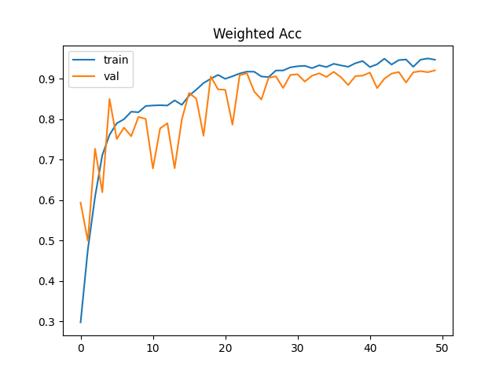
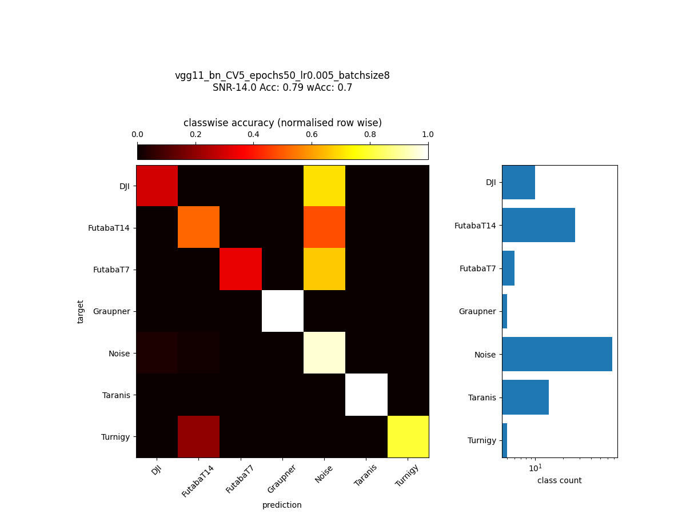
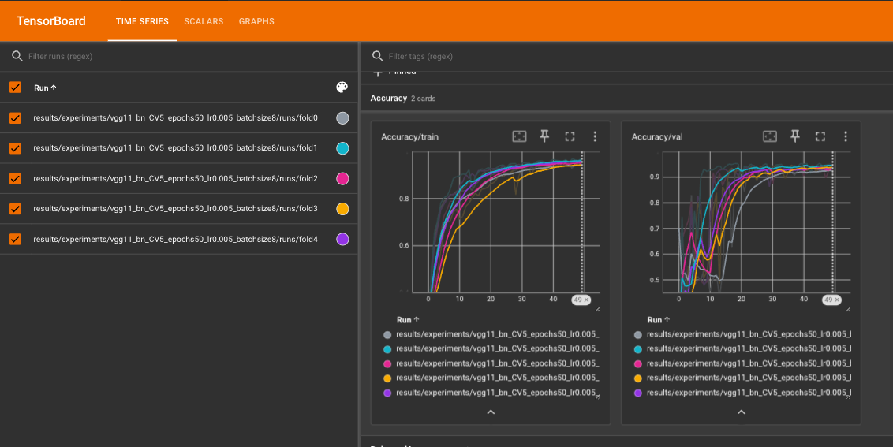

# Robust Drone Detection and Classification Using Convolutional Neural Networks in Low SNR Environments
Code to reproduce the experiments from the paper:

S. Glüge, M. Nyfeler, A. Aghaebrahimian, N. Ramagnano and C. Schüpbach, "Robust Low-Cost Drone Detection and Classification Using Convolutional Neural Networks in Low SNR Environments," in IEEE Journal of Radio Frequency Identification, vol. 8, pp. 821-830, 2024, doi: [10.1109/JRFID.2024.3487303](https://doi.org/10.1109/JRFID.2024.3487303)


## Dataset
The dataset is available at [kaggle](https://www.kaggle.com/datasets/sgluege/noisy-drone-rf-signal-classification-v2). Download the dataset and place it in a subfolder `data/`. 

It comes in the form of 3 filetypes:
- `class_stats.csv`: a single file containing the number of samples per class
- `SNR_stats.csv`:  a single file containing the number of samples per SNR
- `IQdata_sampleX_targetY_snrZ.pt`: sample files that contain the IQ signal of sample X, with target Y at SNR level of Z

## Load and inspect the dataset
Use the script `load_dataset.py` to load the dataset using a custom torch Dataloader. It also plots a sample of the dataset which should look like this: 


Note that we plot the power spectrum of the IQ signal, which is the log10 of the absolute value of the FFT of the IQ signal 
```python
power_spec = np.log10(np.sqrt(spectrogram_2d[0,:,:]**2 + spectrogram_2d[1,:,:]**2))
```

## Train a CNN (VGG) on the dataset
`train_model_cv5.py` trains a VGG11_BN on the dataset using 5-fold cross-validation. The script saves the model and the training history in a subfolder `results/experiments/experiment_name`. I.e. training a VGG11_BN for 50 epochs with start learning rate 0.005 and batch size 8 ->
`results/experiments/vgg11_bn_CV5_epochs50_lr0.005_batchsize8`

To train the model, run the following command:
```bash
python train_model_cv5.py
```

Training one epoch of the dataset takes about 5 minutes for a VGG11_BN on a single NVIDIA A100.

Results for each fold are stored as a dictionary in a pickle file (`results_foldN.pkl`). The dictionary contains the following keys:
- `train_weighted_acc`: weighted accuracy on the training set
- `train_acc`: accuracy on the training set
- `train_loss`: loss on the training set
- `val_weighted_acc`: weighted accuracy on the validation set
- `val_acc`: accuracy on the validation set
- `val_loss`: loss on the validation set
- `best_epoch`: epoch with the best validation accuracy
- `test_acc`: accuracy on the test set
- `test_weighted_acc`: weighted accuracy on the test set
- `test_predictions`: predictions on the test set
- `test_targets`: targets on the test set
- `test_snrs`: SNRs on the test set
- `class_names`: class names
- `train_idx`: indices of the training set
- `val_idx`: indices of the validation set
- `test_idx`: indices of the test set

The respective model is stored in a separate file `model_foldN.pth`. Furhtermore, the training/validation loss, accuracy and weighted accuracy are plotted and stored in a file, e.g. `plots/weighted_acc_foldN.png`.



## Evaluate the model on diffrent SNR levels
`eval_model_with_cm_per_SNR_cv5.py` evaluates the model predeictions according to diffrent SNR levels. The script saves the confusion matrix and the classification report in a subfolder `results/experiments/vgg11_bn_CV5_epochs50_lr0.005_batchsize8`. I.e. evaluating the model for the VGG11_BN trained in the previous step. The plots of the confusion matrix are stored in a subfolder `plots/foldN/`. For instance `cm_SNR-14.png` shows the confusion matrix for the SNR level -14 dB.



The classification report for all SNR levels is stored as `acc.csv` in the same folder.

| fold | accuracy train | accuracy test | weighted accuracy train | weighted accuracy test | best_epoch |
|------|----------------|---------------|-------------------------|------------------------|------------|
| 0    | 0.9469003081321716 | 0.930402934551239 | 0.9466673135757446 | 0.9268965125083923 | 49         |
| 1    | 0.9582599401473999 | 0.9467455744743347 | 0.9585657119750977 | 0.927419126033783 | 39         |
| 2    | 0.9400317072868347 | 0.9464637637138367 | 0.939556360244751 | 0.9236124753952026 | 24         |
| 3    | 0.9486615061759949 | 0.9405466318130493 | 0.9485337734222412 | 0.9301179051399231 | 46         |
| 4    | 0.9581719040870667 | 0.9481543898582458 | 0.9575132131576538 | 0.9338380098342896 | 43         |
| mean | 0.9504050731658935 | 0.9424626588821411 | 0.9501672744750976 | 0.9283768057823181 | 40.2       |
| std  | 0.006999324557497465 | 0.006570481230705516 | 0.007099381949997308 | 0.0034253011367031045 | 8.749857141690944 |

The accuracy per SNR level is stored in a file `acc_per_SNR.csv` in the same folder.

## Tensorboard
During training several metrics are logged to tensorboard. To start tensorboard run the following command:
```bash
tensorboard --logdir results/experiments/vgg11_bn_CV5_epochs50_lr0.005_batchsize8
```
Then open a browser and navigate to `localhost:6006` to see the training progress.



## Related Literature
S. Glüge, M. Nyfeler, A. Aghaebrahimian, N. Ramagnano and C. Schüpbach, "Robust Low-Cost Drone Detection and Classification Using Convolutional Neural Networks in Low SNR Environments," in IEEE Journal of Radio Frequency Identification, vol. 8, pp. 821-830, 2024, doi: [10.1109/JRFID.2024.3487303](https://doi.org/10.1109/JRFID.2024.3487303)

```
@ARTICLE{10737118,
  author={Glüge, Stefan and Nyfeler, Matthias and Aghaebrahimian, Ahmad and Ramagnano, Nicola and Schüpbach, Christof},
  journal={IEEE Journal of Radio Frequency Identification}, 
  title={Robust Low-Cost Drone Detection and Classification Using Convolutional Neural Networks in Low SNR Environments}, 
  year={2024},
  volume={8},
  number={},
  pages={821-830},
  doi={10.1109/JRFID.2024.3487303}
}
```

## Trained models
You can download the models and evaluation results from the experiment above from [Zenodo](https://zenodo.org/records/14065652).